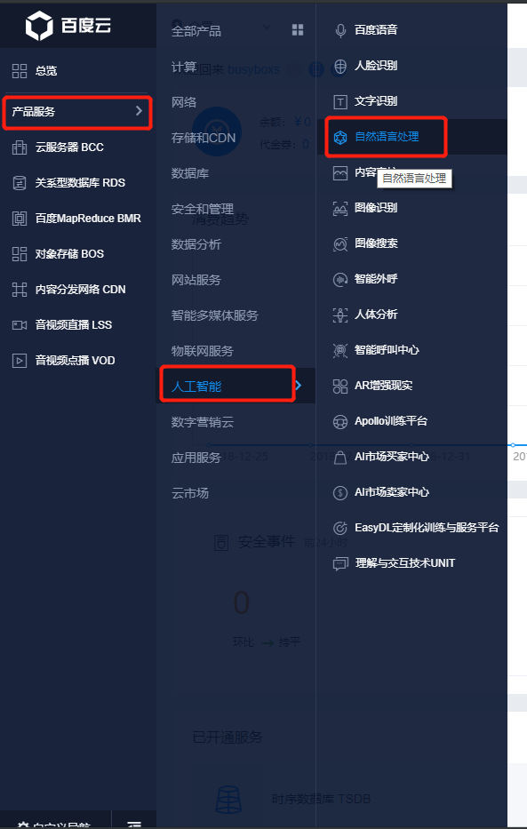
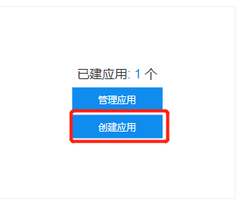
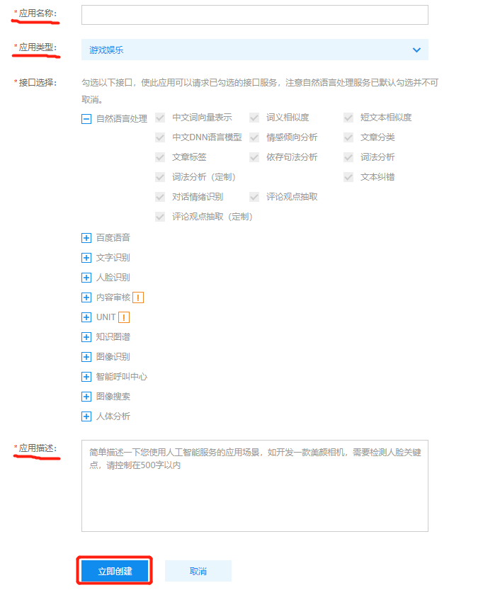
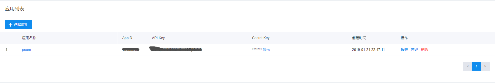

# 使用百度nlp API实现的写诗和对对联

## 创建NLP应用

1. 首先在[百度云](https://console.bce.baidu.com/#/index/overview)中找到自然语言处理服务
    
    
    
2. 点击创建应用

    
    
3. 填写相关信息，并创建应用

    
    
4. 创建好之后就能获取到 `API key` 和 `Secret Key` 了
    
    
    
5. 将上面两个key填到 poem.py 的 `get_token_key()`
6. 调用 `get_token_key` 获取 token key
7. 将 token key 字符串填到 couplet.py 中
8. 执行 couplets.py
9. 浏览器访问 127.0.0.1:5000