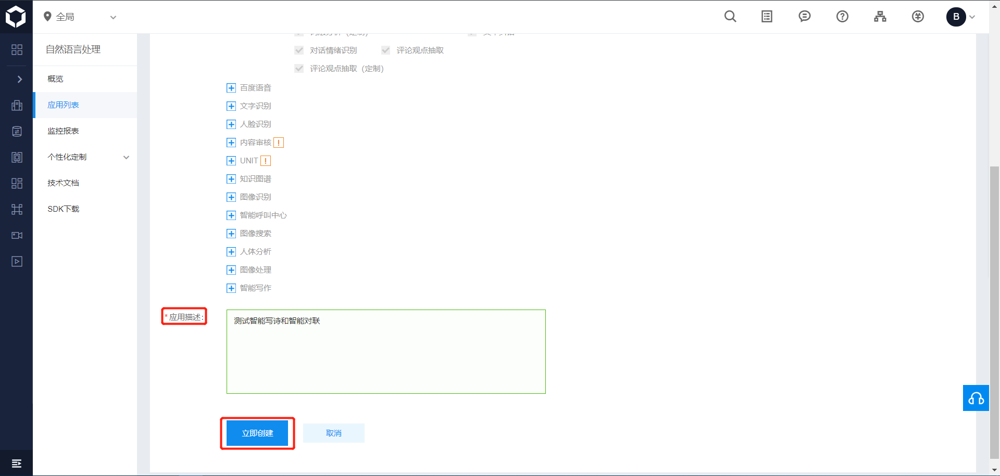

# 【百度大脑新品体验】 智能写诗 & 智能春联

百度 AI 目前提供了智能写作的接口，主要包括智能写诗接口与智能春联接口。具体的使用说明可以参考文档 [http://ai.baidu.com/docs#/IntelligentWriting-API/f85d34cc](http://ai.baidu.com/docs#/IntelligentWriting-API/f85d34cc).

## 智能写作接口说明

### 智能春联接口

智能春联是指根据用户输入的命题关键词自动生成一副春联，包括上联、下联和横批。

智能春联的请求参数如下表：

|参数|是否必选|类型|描述|
|:---:|:---:|:---:|:---:|
|text|是	|string|字符串（限5字符数以内）即春联的主题|
|index|否|int|整数 默认为数值为0，即第一幅春联。每换一次，数值加1即可，一定数量后会返回之前的春联结果。|

上面两个字符段是接口的输入，`text` 字数小于 5，是春联的主题。 `index` 可以用来指定生成的对联，不同的 `index` 可能会生成不同的对联。

智能春联的返回参数如下表：

|参数|类型|描述|
|:---:|:---:|:---:|
|couplets|object|object嵌套结构，对应返回的春联|
|+first|string|春联上联：成7-9个字的上联|
|+second|string|春联下联：生成7-9个字的春联下联|
|+center|string|春联横批：生成4个字的春联横批|

其输出为 json 字符串。例如：“春节”对应的一个输出为

```json
{'couplets': {'center': '迎春接福', 'first': '春节迎春新世纪', 'second': '福音报福小康年'}}
```

### 智能写诗接口

智能写诗是指根据用户输入的命题关键词自动生成一首7言绝句。

智能写诗的请求参数如下表：

|参数|是否必选|类型|描述|
|:---:|:---:|:---:|:---:|
|text|是|string|字符串（限5字符数以内，）即作诗的主题|
|index|否|int|整数 默认为数值为0，即第一首诗。每换一次，数值加1即可，一定数量后会返回之前的作诗结果|

这两个输入字段和智能春联的两个输入字段相同，只是，`text` 代表诗的主题

智能写诗的返回参数如下表：

|参数|类型|描述|
|:---:|:---:|:---:|
|poem|array|数组结构，元素对应7言绝句诗|
|+title|string|诗名，即用户输入作诗主题|
|+content|string|作诗结果：为一首7言绝句|

其输出也是 json 字符串，例如：“百度”对应的一个输出为

```
{'poem': [{'content': '神州崛起宏图展\t华夏腾飞巨浪狂\t万里江山添锦绣\t千秋百度铸辉煌\t', 'title': '百度'}]}
```

### 错误码说明

|错误码|错误信息|描述|
|:---:|:---:|:---:|
|52000|成功|无|
|52001|请求超时|重试|
|52002|系统错误|重试|
|52003|未授权用户|检查您的appid是否正确|
|52004|输入解析失败|检查输入编码格式，有无特殊字符，是否是json格式|
|52005|输入字段有误|是否包含text字段|
|52006|输入文本长度有误|输入不能超过5个字符|
|52007|输入文本包含政治&黄色内容|换输入文本|
|52008|后台服务返回错误|重试|
|54003|访问频率受限|请降低您的调用频率|
|54100|查询接口参数为空|检查是否少传参数|
|54102|无写诗结果|重试|
|2|后端连接超时|重试|

## 代码实现

本文使用 python3 来调用智能春联和智能写诗接口，接下来一步一步进行说明。

### 创建应用

首先进入到控制台，然后在“总览”下找到“产品服务” -> “人工智能” -> “自然语言处理”。


然后点击创建应用，填写好“应用名称”、“应用描述”，其他默认就行，然后点击“创建”。




创建好应用之后，进入“应用列表”，就能看到应用的相关信息，我们需要的是 `API Key` 和 `Secret Key`。


### 获取 access token

通过 `API Key` 和 `Secret Key` 获取的 `access_token`。更多关于 `access_token` 的获取方法参考 [http://ai.baidu.com/docs#/Auth/top](http://ai.baidu.com/docs#/Auth/top)。

下面代码是 python3 获取 access_token 的代码

```python
# 获取 token
def get_token_key():
    token_key = ''
    # client_id 为官网获取的AK， client_secret 为官网获取的SK
    client_id = '【百度云应用的AK】'
    client_secret = '【百度云应用的SK】'

    host = f'https://aip.baidubce.com/oauth/2.0/token?grant_type=client_credentials' \
        f'&client_id={client_id}&client_secret={client_secret}'

    request = Request(host)
    request.add_header('Content-Type', 'application/json; charset=UTF-8')
    response = urlopen(request)
    token_content = response.read()
    if token_content:
        token_info = json.loads(token_content)
        token_key = token_info['access_token']
    return token_key
```

token_content 中包含很多信息，例如输出如下(为了我个人信息安全，部分内容用 * 代替)：

```
{'access_token': '****************************************',
 'expires_in': 2592000,
 'refresh_token': '*******************************************',
 'scope': 'brain_nlp_sentiment_classify_custom public nlp_simnet nlp_wordemb '
          'nlp_comtag nlp_dnnlm_cn brain_nlp_lexer brain_all_scope '
          'brain_nlp_comment_tag brain_nlp_dnnlm_cn brain_nlp_word_emb_vec '
          'brain_nlp_word_emb_sim brain_nlp_sentiment_classify '
          'brain_nlp_simnet brain_nlp_depparser brain_nlp_wordembedding '
          'brain_nlp_dnnlm_cn_legacy brain_nlp_simnet_legacy '
          'brain_nlp_comment_tag_legacy brain_nlp_lexer_custom '
          'brain_nlp_keyword brain_nlp_topic brain_nlp_ecnet brain_nlp_emotion '
          'brain_nlp_comment_tag_custom wise_adapt lebo_resource_base '
          'lightservice_public hetu_basic lightcms_map_poi kaidian_kaidian '
          'ApsMisTest_Test权限 vis-classify_flower lpq_开放 cop_helloScope '
          'ApsMis_fangdi_permission smartapp_snsapi_base iop_autocar '
          'oauth_tp_app smartapp_smart_game_openapi oauth_sessionkey '
          'smartapp_swanid_verify smartapp_opensource_openapi',
 'session_key': '*****************************',
 'session_secret': '*******************************'}
```

而我们需要的只是 access_token，因此只需获取该字段就行。

### 调用智能春联接口

调用智能春联接口的 python3 实现代码如下：

```python
# 调用百度 AI 智能春联接口（用于测试）
def get_couplets(text, token_key, index=0):
    """
    调用百度AI智能春联接口，并生成横批、上联和下联
    :param text: 智能春联的主题（官方限制不超过5个字）
    :param token_key: 通过调用 get_token_key() 获取的 token
    :param index: 不同的 index 会生成不同的春联
    :return: 调用智能春联生成的数据
    """
    request_url = 'https://aip.baidubce.com/rpc/2.0/nlp/v1/couplets'
    params_d = dict()
    params_d['text'] = text
    params_d['index'] = index
    params = json.dumps(params_d).encode('utf-8')
    access_token = token_key
    request_url = request_url + "?access_token=" + access_token
    request = Request(url=request_url, data=params)
    request.add_header('Content-Type', 'application/json')
    response = urlopen(request)
    content = response.read()
    if content:
        data = json.loads(content)
        return data

# 解析生成的春联
def parse_couplets(data):
    """
    解析调用智能春联生成的数据
    :param data: 调用智能春联生成的有效数据
    :return: 横批（center）、上联（first）和下联（second）
    """
    center = data['couplets']['center']
    first = data['couplets']['first']
    second = data['couplets']['second']
    # print(f'上联：{first}')
    # print(f'下联：{second}')
    # print(f'横批：{center}')
    return center, first, second
```

`get_couplets` 函数调用接口得到返回的值，`parse_couplets` 函数解析调用智能春联生成的有效数据。这里所说的有效数据是指调用接口没有发生错误的情况。在正确调用接口时，data 输出示例如下：

```
{'couplets': {'center': '迎春接福', 'first': '春节迎春新世纪', 'second': '福音报福小康年'}}
```

是一个字典型数据，直接进行解析就能得到横批、上联和下联。如果想要获取同一主题不同的对联，可以尝试不同的 `index`。

当调用接口失败时，就会得到无效的 data，通过解析 data，能够获得错误信息，下面是解析错误的代码，能够返回对应错误的中文描述。

```python
# 错误代码
ERROR_DICT = {
    '2': '后端连接超时请重试',
    '52001': '请求超时请重试',
    '52002': '系统错误请重试',
    '52003': '未授权用户',
    '52004': '输入解析失败',
    '52005': '输入字段有误',
    '52006': '输入文本长度不超过5',
    '52007': '输入文本包含政治&黄色内容',
    '52008': '后台服务返回错误请重试',
    '54003': '访问频率受限',
    '54100': '查询接口参数为空',
    '54102': '无写诗结果请重试'
}

# 解析是否调用接口错误，如果有返回对应的提示，没有返回None
def parse_error(data):
    """
    解析是否调用接口错误
    :param data: 调用接口生成的数据
    :return: 如果出错，返回对应的错误信息，否则返回None
    """
    if 'error_code' in data:
        code = data['error_code']
        error = ERROR_DICT[str(code)]
        return error
    return None
```

### 调用智能写诗接口

调用智能写诗接口的 python3 实现代码如下：

```python
# 调用百度 AI 智能写诗接口（用于测试）
def get_poem(text, token_key, index=0):
    """
    调用百度AI智能写诗接口，并生成七言诗
    :param text: 智能写诗的主题（官方限制不超过5个字）
    :param token_key: 通过调用 get_token_key() 获取的 token
    :param index: 不同的 index 会生成不同的七言诗
    :return: 调用智能写诗生成的数据
    """
    request_url = 'https://aip.baidubce.com/rpc/2.0/nlp/v1/poem'
    params_d = dict()
    params_d['text'] = text
    params_d['index'] = index
    params = json.dumps(params_d).encode('utf-8')
    access_token = token_key
    request_url = request_url + "?access_token=" + access_token
    request = Request(url=request_url, data=params)
    request.add_header('Content-Type', 'application/json')
    response = urlopen(request)
    content = response.read()
    if content:
        data = json.loads(content)
        return data


# 解析生成的诗句
def parse_poem(data):
    """
    解析调用智能写诗生成的数据
    :param data: 调用智能写诗生成的有效数据
    :return: 诗的题目（title）和诗的内容（content）
    """
    title = data['poem'][0]['title']
    poem = data['poem'][0]['content'].replace('\t', '\n')
    # print(title)
    # print(poem)
    return title, poem
```

在正确调用接口时，data 输出如下:

```
{'poem': [{'content': '神州崛起宏图展\t华夏腾飞巨浪狂\t万里江山添锦绣\t千秋百度铸辉煌\t', 'title': '百度'}]}
```

是一个字典型数据，直接进行解析就能得到题目和内容。如果想要获取同一主题不同的诗，可以尝试不同的 `index`。

## 案例应用

本文进一步通过网页的形式将上述功能进行实现，使用Flask来部署。

首先创建一个文件夹 flaskr，该文件夹下有一个名为 static 的文件夹，用于存放css样式和背景图片，还有一个文件夹名为templates用于存放html网页，另外还有一个python文件，用于执行flask。

以下是 Flask 相关代码

```python
from flask import Flask, render_template, request, redirect, url_for, session
from flaskr.poem import nlp_result, parse_error, parse_couplets, parse_poem
import random

app = Flask(__name__)

token_key = '【你获取的token】'


@app.route("/", methods=('GET', 'POST'))
def index():
    if request.method == 'POST':
        couplets = request.form.get('couplets')
        if couplets is not None:
            return redirect(url_for('get_couplets'))
        poem = request.form.get('poem')
        if poem is not None:
            return redirect(url_for('get_poem'))

    return render_template('couplets/index.html')


@app.route("/couplets", methods=('GET', 'POST'))
def get_couplets():
    if request.method == 'POST':
        center = None
        first = None
        second = None
        title = request.form.get('theme')
        back = request.form.get('back')
        if back == '返回':
            return redirect(url_for('index'))
        index = random.randint(0, 10)
        data = nlp_result(title, token_key, index, way='couplets')
        error = parse_error(data)
        if not error:
            center, first, second = parse_couplets(data)
        return render_template('couplets/show.html',
                               center=center,
                               first=first,
                               second=second,
                               title=title,
                               error=error)
    return render_template('couplets/base.html')


@app.route("/poem", methods=('GET', 'POST'))
def get_poem():
    if request.method == 'POST':
        title = None
        poem = None
        title = request.form.get('theme')
        back = request.form.get('back')
        if back == '返回':
            return redirect(url_for('index'))
        index = random.randint(0, 10)
        data = nlp_result(title, token_key, index, way='poem')
        error = parse_error(data)
        if not error:
            title, poem = parse_poem(data)
        return render_template('couplets/poem_show.html',
                               title=title,
                               poem=poem,
                               error=error)
    return render_template('couplets/poem_index.html')


if __name__ == '__main__':
    app.run(debug=True)

```

该代码中有三个函数，分别对应三个界面，如果运行地址为 http://127.0.0.1:5000/，那么三个界面对应的网址分别为 http://127.0.0.1:5000/ 、http://127.0.0.1:5000/couplets 和 http://127.0.0.1:5000/poem。表示主页、对联页和写诗页。

其效果展示如下：


处理错误信息的效果展示如下：


完整代码请移步 [https://github.com/busyboxs/couplet-and-poem](https://github.com/busyboxs/couplet-and-poem), 第一次玩，求轻喷！